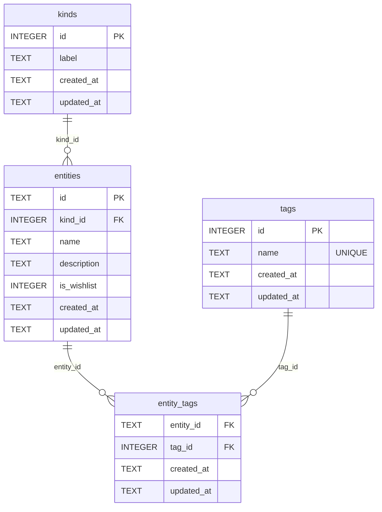

# shikouroku

Cloudflare Workers 1つで `API + React SPA` を同一ドメイン配信する最小構成です。

- Frontend: React + TypeScript + Vite (`apps/web`)
- Backend: Cloudflare Workers + TypeScript + Hono (`apps/api`)
- Static files: `apps/api/wrangler.toml` の `[assets] directory = "../web/dist"`
- Auth: `https://auth.takagi.dev` を利用（JWTをHttpOnly Cookieで保持）
- UI: Tailwind CSS + shadcn/ui（button/card/input/label/form）
- DB: Cloudflare D1（`apps/api/wrangler.toml` の `DB` バインディング）

## 前提

- Node.js 20+
- npm
- Cloudflare アカウント

## セットアップ

```bash
npm install
```

## Tailwind + shadcn/ui 導入コマンド（実施済み）

```bash
npm --workspace @shikouroku/web install -D tailwindcss postcss autoprefixer @types/node
npm --workspace @shikouroku/web install class-variance-authority clsx tailwind-merge lucide-react @radix-ui/react-slot @radix-ui/react-label react-hook-form
```

追加した主なファイル:

- `apps/web/tailwind.config.ts`
- `apps/web/postcss.config.js`
- `apps/web/components.json`
- `apps/web/eslint.config.js`
- `apps/web/src/shared/lib/utils.ts`
- `apps/web/src/shared/ui/*`
- `apps/web/src/shared/ui/form-controls/*`
- `apps/web/src/features/auth/index.ts`
- `apps/web/src/features/entities/index.ts`

## フロントエンド構成（現行）

`apps/web/src` は次の責務分割で管理しています。

- `app`: ルーターやアプリ全体の構成
- `pages`: ルーティング単位の薄い画面コンポーネント
- `features`: ユースケース単位のUI/ロジック
- `shared`: 共通UI・APIクライアント・ユーティリティ
- `widgets`: レイアウト共通部品（ヘッダー・フッター）

## ローカル開発

### 推奨（並列起動）

```bash
npm run dev
```

- Web: `http://localhost:5173` (Vite)
- API: `http://127.0.0.1:8787` (Wrangler)
- Web側は `/api` を Wrangler に proxy するため、フロントから同一オリジン感覚で API を呼び出せます。
- API は `wrangler dev --remote` で起動し、`preview_database_id`（開発DB）を参照します。
- 事前に `npm run d1:migrate:dev` を実行してください（`--preview` で開発DBへ適用）。
- 開発データを入れる場合は `npm run d1:seed:dev` を実行してください。

### 本番相当（Workerで静的配信まで確認）

```bash
npm run build
npm --workspace @shikouroku/api run dev
```

- `http://127.0.0.1:8787` で SPA と API を同一オリジンで確認できます。

## 認証フロー

- 未ログインで `/` にアクセスすると Worker が `/login` へ `302` リダイレクト
- ログイン成功で `/` へ遷移
- ログイン済みで `/login` にアクセスすると `/` へ `302` リダイレクト
- API は `/api/login` 以外を認証必須にし、未認証は `401`

ログインは `auth.takagi.dev` の `POST /login` を使い、取得したJWTを `shikouroku_token` Cookie に保存します。  
リクエスト時は `GET /verify` でトークン検証します。

認証APIの接続先は `apps/api/wrangler.toml` の `[vars] AUTH_BASE_URL` で切り替え可能です。

## ビルド

```bash
npm run build
```

- `apps/web/dist` を生成
- API の型チェック実行

## 品質チェック

```bash
npm run lint
npm run test
npm run test:api
npm run typecheck
npm run quality:api
```

- `lint`: `apps/web/eslint.config.js` の依存境界・命名規約を検証
- `test`: `apps/web/tests` のユニットテスト（Vitest）を実行
- `test:api`: `apps/api/tests` の契約/ユニットテスト（Vitest）を実行
- `typecheck`: ワークスペース全体の型チェックを実行
- `quality:api`: APIの `check + test` を連続実行
- CI:
  - `.github/workflows/web-quality.yml` で `lint` / `test` / `typecheck` を実行
  - `.github/workflows/api-quality.yml` で `quality:api` を実行

## D1 セットアップ

1. D1 DB を作成（production / development）

```bash
npx wrangler d1 create shikouroku-prod
npx wrangler d1 create shikouroku-dev
```

2. `apps/api/wrangler.toml` を次の方針で設定

```toml
[[d1_databases]]
binding = "DB"
database_name = "shikouroku-prod"
database_id = "PROD_DATABASE_ID"
preview_database_id = "DEV_DATABASE_ID"
```

3. マイグレーション適用（開発DB = `preview_database_id`）

```bash
npm run d1:migrate:dev
```

4. シードデータ投入（開発DB = `preview_database_id`）

```bash
npm run d1:seed:dev
```

5. マイグレーション適用（本番DB = `database_id`）

```bash
npm run d1:migrate:prod
```

## ER図



`entity_tags` は `(entity_id, tag_id)` の複合主キーです。

## デプロイ（Workers一本）

初回のみ Cloudflare ログイン:

```bash
npx wrangler login
```

デプロイ:

```bash
npm run deploy
```

これで 1 つの Workers サービス `shikouroku` に以下がまとまってデプロイされます。

- `/api/*`: Hono API
- `/` とその他パス: `apps/web/dist` の静的ファイル（SPA fallback あり）

## 動作確認

1. `npm run dev` を実行
2. `http://localhost:5173` を開く
3. ログイン画面が表示される
4. ログイン後に一覧画面が表示され、データ取得できる
5. `npm run build` が成功する
